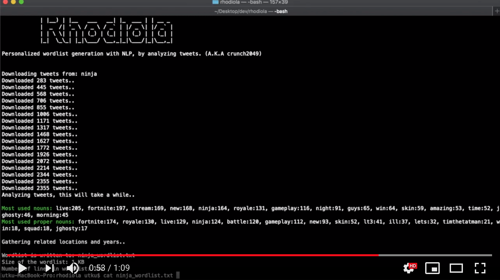

```
                            Utku Sen's
                             _____  _               _ _       _                            
                            |  __ \| |             | (_)     | |                            
                            | |__) | |__   ___   __| |_  ___ | | __ _ 
                            |  _  /| '_ \ / _ \ / _` | |/ _ \| |/ _` |                       
                            | | \ \| | | | (_) | (_| | | (_) | | (_| |
                            |_|  \_\_| |_|\___/ \__,_|_|\___/|_|\__,_|                           

               Personalized wordlist generation by analyzing tweets. (A.K.A crunch2049)

```

Rhodiola tool is developed to narrow the brute force combination pool by creating a personalized wordlist for target people. It finds interest areas of a given user by analyzing his/her tweets, and builds a personalized wordlist.

## The Idea

Adversaries need to have a wordlist or combination-generation tool while conducting password guessing attacks. To narrow the combination pool, researchers developed a method named ”mask attack” where the attacker needs to assume a password’s structure. Even if it narrows the combination pool significantly, it’s still too large to use for online attacks or offline attacks with low hardware resources. Analyses on leaked password databases showed that people tend to use meaningful English words for their passwords, and most of them are nouns or proper nouns. Other research shows that people are choosing these nouns from their hobbies and other interest areas. Since people are exposing their hobbies and other interest areas on Twitter, it’s possible to identify these by analyzing their tweets. Rhodiola does that.

## Installation

Rhodiola is written in Python 2.7 and tested on macOS, Debian based Linux systems. To install Rhodiola, run `sudo python install.py` on Rhodiola's directory. It will download and install necessary libraries and files. (Note:pip is required)

Rhodiola requires Twitter Developer API keys to work (If you don't have that one, you can bring your own data. Check the details below). You can get them by creating a Twitter app from here: https://developer.twitter.com/en/docs/basics/getting-started

After you get API keys, open Rhodiola.py with your favourite text editor and edit following fields:

```
consumer_key = "YOUR_DATA_HERE"
consumer_secret = "YOUR_DATA_HERE"
access_key = "YOUR_DATA_HERE"
access_secret = "YOUR_DATA_HERE"

```

## Usage

Rhodiola has three different usage styles: base, regex and mask.

In the base mode, Rhodiola takes a Twitter handle as an argument and generates a personalized wordlist with the following elements: Most used nouns&proper nouns, paired nouns&proper nouns, cities and years related to them. 

Example command: `python rhodiola.py --username elonmusk`

Example output:

```
...
tesla
car
boring
spacex
falcon
rocket
mars
earth
flamethrower
coloradosprings
tesla1856
boringcompany2018
...
```

In the regex mode, you can generate additional strings with the provided regex. These generated strings will be appended as a prefix or suffix to the words. For this mode, Rhodiola takes a regex value as an argument. There is also an optional argument: ”regex_place” which defines the string placement (Can be:"prefix" or "suffix". Default value is "suffix"). 

Example command: `python rhodiola.py --username elonmusk --regex "(root|admin)\d{2}"`

Example output:

```
...
teslaroot01
teslaroot02
teslaroot03
...
spacexadmin01
spacexadmin02
spacexadmin03
...
tesla1856root99
...
boringcompany2018admin99
...
```

In the mask mode, user can provide hashcat style mask values. Only \l (lower-alpha) and \u (upper-alpha) charsets are available. 

Example command: `python rhodiola.py --username elonmusk --mask "?u?l?u?u?l"`

Example output:

```
...
TeSLa
CaR
BoRIng
SpACex
FaLCon
RoCKet
MaRS
EaRTh
FlAMethrower
CoLOradosprings
TeSLa1856
BoRIngcompany2018
...
```

## Bring Your Own Data

If you don't have any Twitter API keys or you want to bring your own data, you can do it as well. Rhodiola provides you two different options. You can provide a text file which contains arbitrary text data, or you can provide a text file which contains different URLS. Rhodiola parses the texts from those URLs.

Example command: `python rhodiola.py --filename mydata.txt"` 

mydata.txt contains:

```
Lorem Ipsum is simply dummy text of the printing and typesetting industry. Lorem Ipsum has been the industry's standard dummy text ever since the 1500s, when an unknown printer took a galley of type and scrambled it to make a type specimen book. It has survived not only five centuries, but also the leap into electronic typesetting, remaining essentially unchanged. It was popularised in the 1960s with the release of Letraset sheets containing Lorem Ipsum passages, and more recently with desktop publishing software like Aldus PageMaker including versions of Lorem Ipsum.
```

Example command: `python rhodiola.py --urlfile blogs.txt"` 

blogs.txt contains:

```
https://example.com/post1.html
https://example.com/post2.html
https://cnn.com/news.html
```

## Demo Video

[](https://www.youtube.com/watch?v=ouDGlIEU9o8)
